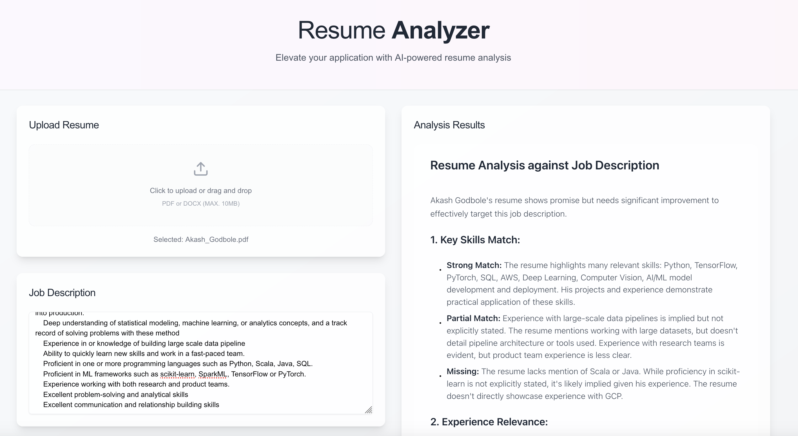

# AI Resume Analyzer 📄✨

A modern web application that helps job seekers analyze their resumes against job descriptions using artificial intelligence. Get instant feedback on how well your resume matches the position you're applying for.



## ⚡ Live Demo

Check out the live demo: [AI Resume Analyzer](https://airesume-analyzer.vercel.app/)

## ✨ Features

- **Resume Upload**: Support for PDF and DOCX formats
- **Job Description Analysis**: Paste any job description for comparison
- **Smart Analysis**: Powered by Google's Gemini AI
- **Detailed Feedback**: Get insights on:
  - Key skills match and gaps
  - Experience relevance
  - Missing critical requirements
  - Suggested improvements
- **Clean UI**: Modern, responsive interface with elegant design

## 🛠️ Tech Stack

### Frontend
- Next.js 14 (React)
- TypeScript
- Tailwind CSS
- shadcn/ui Components

### Backend
- Flask (Python)
- Google Gemini AI
- pdfplumber (PDF processing)
- python-docx (DOCX processing)

## 🚀 Getting Started

### Prerequisites
- Node.js (v16 or higher)
- Python 3.9+
- Google Gemini API key

### Frontend Setup
1. Clone the repository:
   ```bash
   git clone https://github.com/yourusername/ai-resume-analyzer.git
   cd ai-resume-analyzer
   ```

2. Install frontend dependencies:
   ```bash
   cd frontend
   npm install
   ```

3. Run the development server:
   ```bash
   npm run dev
   ```

### Backend Setup
1. Create a virtual environment:
   ```bash
   cd backend
   python -m venv venv
   source venv/bin/activate  # On Windows: venv\Scripts\activate
   ```

2. Install dependencies:
   ```bash
   pip install -r requirements.txt
   ```

3. Create a `.env` file in the backend directory:
   ```env
   GOOGLE_API_KEY=your_gemini_api_key_here
   ```

4. Start the Flask server:
   ```bash
   python app.py
   ```

The application will be available at `http://localhost:3000`

## 📝 Usage

1. Upload your resume (PDF or DOCX format)
2. Paste the job description you're interested in
3. Click "Analyze Resume"
4. Review the detailed analysis and suggestions
5. Make improvements to your resume based on the feedback

## 🔒 Privacy

- Files are processed locally and not stored
- Job descriptions are not retained after analysis
- No personal data is collected or stored

## 🤝 Contributing

Contributions are welcome! Please feel free to submit a Pull Request.

1. Fork the repository
2. Create your feature branch (`git checkout -b feature/AmazingFeature`)
3. Commit your changes (`git commit -m 'Add some AmazingFeature'`)
4. Push to the branch (`git push origin feature/AmazingFeature`)
5. Open a Pull Request

